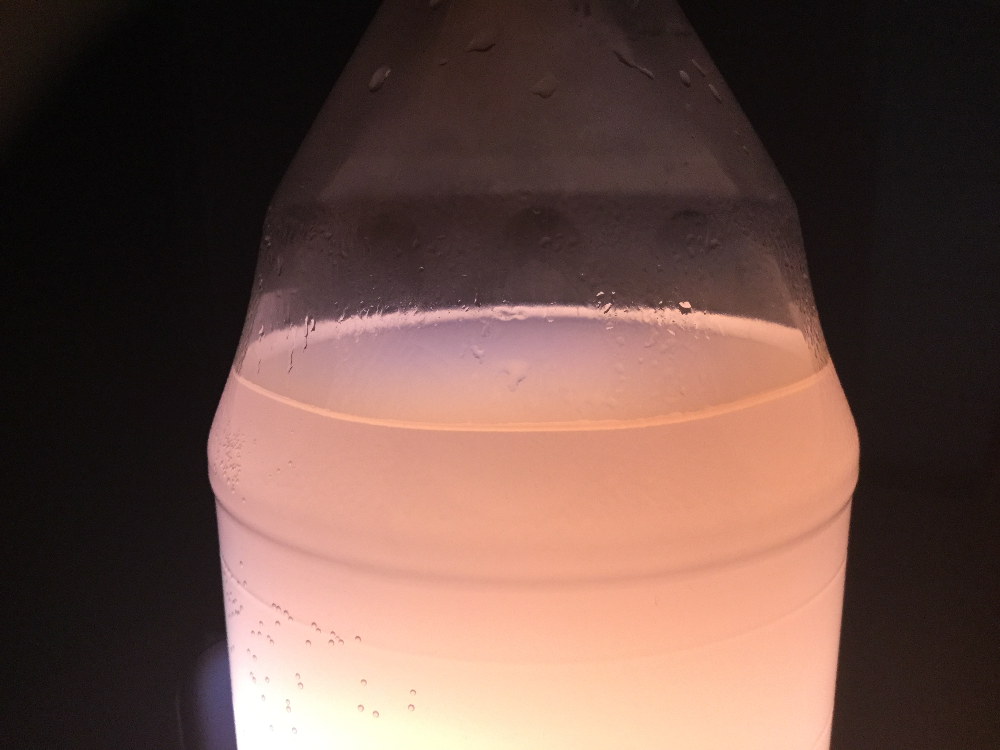
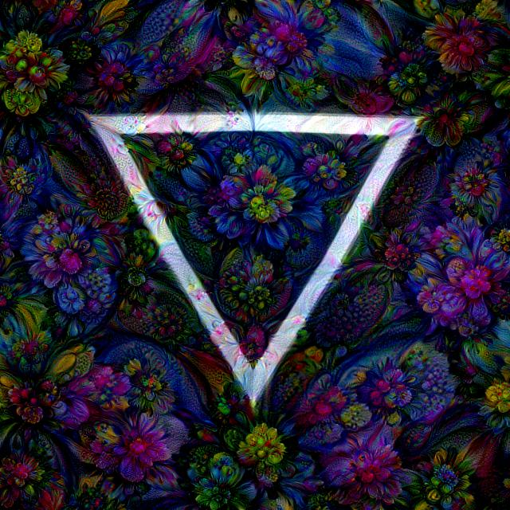

# Machine-Learning-for-Computer-Vision
This project experiments various machine learning models on computer vision tasks such as image super resolution, style transferring, and object detection. 

## Introduction
Machine learning is now a fast developing research field with vast applications. The objective of this summary is to briefly explain how some neural network for processing image in some form of artistic ways and image classification and some thought on them. The main focus is to apply machine learning methods to computer vision tasks. Here, we experiment with various tasks such as style transferring, image super resolution, and image classification.

## Style transfer net
The style transfer model is trained to transfer pattern of a style image to another image. 	

### Algorithm:
Convolution neural network is used for the model. The style loss and content loss are measured by loss function. The loss function can be VGG, MSE. The basic idea that the model can extract image style from the style image match it on to the contour of the other image. 

Resize the input image and style images. 

Load vgg16 model 

From the latent layers, we seperate content and style 

Minimize loss: 

-Content loss 

-Style loss 

optimize with the L-BFGS algorithm. 

### Result:
The result is better when more suitable image is chosen. The result image will kind of look like filling the pattern of the style image into the unclear contour of the other image. 
Content image | Style image | Style transfer result
------------ | ------------- | -------------
 |  | 
 ||
 ||
||
||

### Thought:
Although this model is good to create some artistic image, the generated image probably will not truly reflect the style of the style image since the model cannot often properly match the pattern to the correct place. 

## Deep dream net:
The deep dream net makes the image look very wired by make some pattern in the image look like pattern of something else.

### Algorithm:
The algorithm is slightly similar to the style transfer. The convolution layers are used in the model. The basic idea is to make the detail in the original image that looks like feature in the style image more like the feature of the style image. 

### Result:
This result image often looks very wired and sometimes horrifying. The generated image will have detail that resemble the feature of the style image, but the color is chaotic. 

Content image | Deep dream result | Repeatly processed result
------------ | ------------- | -------------
||
||

### Thought:
The algorithm might be able to generate something more interesting than the weird image by slightly altering the model.

## Super resolution:
The model can make resize the image and recover some detail.

### Algorithm:
The model consists Gan and residual block. discriminator of the Gan is trained first to check whether the generated image is real enough. 

### Result: 
The generated image is almost indistinguishable to people who has few experiences in art. Blurry edges can often be wrongly generated and the color might changed slightly. Although it cannot recover full lost detail in some cases, the result is good enough.

Original image | Orignal image(downscale) | Result
------------ | ------------- | -------------
||

## Yolonet:
This algorithm detect object image and locate its position with a bounding box. It is trained with data with proper labels.
Costum data Result after trained for a short time:

	

		
### Thought: 
The result is quite good for detecting those objects that is hardly distinguish from background after trained for a short time. 

### References:
Johnson, J., Alahi, A., & Fei-Fei, L. (2016, October). Perceptual losses for real-time style transfer and super-resolution. In European conference on computer vision (pp. 694-711). Springer, Cham.

### Code references:
Style transfer: https://github.com/lengstrom/fast-style-transfer
