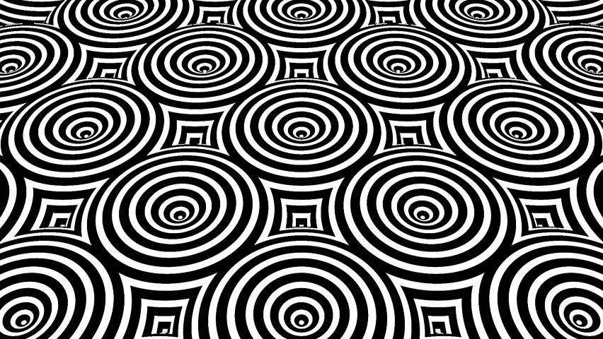
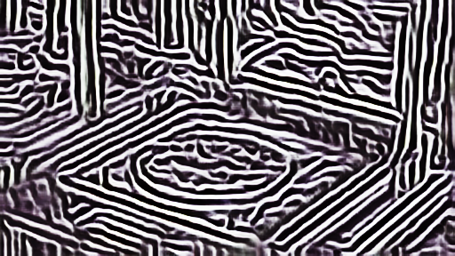

# Machine-Learning-for-Computer-Vision
This project experiments various machine learning models on computer vision tasks such as image super resolution, style transferring, and object detection. 

Introduction:
The objective of this summary is to briefly explain how some neural network for processing image in some form of artistic ways and image classification and some thought on them 

Style transfer net:
	The style transfer model is trained to transfer pattern of a style image to another image. 

Algorithm:
Convolution neural network is used for the model. The style loss and content loss are measured by loss function. The loss function can be VGG, MSE. The basic idea that the model can extract image style from the style image match it on to the contour of the other image. 

Result:
	The result is better when more suitable image is chosen. The result image will kind of look like filling the pattern of the style image into the unclear contour of the other image. 
	
Content image:

Style image:

Style transfer result: 

Content image:

Style image:

Style transfer result: 

Thought:
	Although this model is good to create some artistic image, the generated image probably will not truly reflect the style of the style image since the model cannot often properly match the pattern to the correct place. 

Deep dream net:
	The deep dream net makes the image look very wired by make some pattern in the image look like pattern of something else.

Algorithm:
		The algorithm is slightly similar to the style transfer. The convolution layers are used in the model. The basic idea is to make the detail in the original image that looks like feature in the style image more like the feature of the style image. 

Result:
This result image often looks very wired and sometimes horrifying. The generated image will have detail that resemble the feature of the style image, but the color is chaotic. 

Original image:

Deep dream result: 

Thought:
The algorithm might be able to generate something more interesting than the weird image by slightly altering the model.

Super resolution:
The model can make resize the image and recover some detail.

Algorithm:
The model consists Gan and residual block. discriminator of the Gan is trained first to check whether the generated image is real enough. 

Result: 
The generated image is almost indistinguishable to people who has few experiences in art. Blurry edges can often be wrongly generated. Although it cannot recover full lost detail in some cases, the result is good enough.
